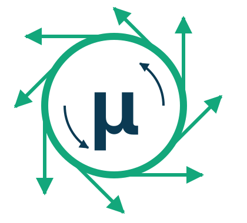

# Muon Induced Neutrino Tool (MINT)

[](https://github.com/jchoi55/MINT/actions/workflows/tests.yml)
[](https://codecov.io/gh/jchoi55/MINT)
[](https://arxiv.org/abs/2608.02718 )



Neutrino fluxes at muon colliders and neutrino factories.
MINT decays muons along realistic accelerator lattices
(built from MAD-X TFS tables or simple parametric geometries), including
polarization, radiative corrections to the decay, and beam optics
(beam size and divergence). 
It also propagates the neutrinos to
arbitrary detector locations and estimates neutrino event rates with ray tracing through detector geometries.

## Installation

```bash
pip install .            # from the repository root
pip install -e .[dev]    # editable install for development
```

## Quickstart

```python
import numpy as np
import mint

# 1. Load a collider-ring lattice shipped with MINT
print(mint.lattices.available())
ring = mint.lattices.load("mc_10tev_hybrid_v06")

# ... or build one from your own MAD-X TWISS/TFS file
# ring = mint.lattices.from_tfs("my_ring.tfs", emittance_RMS=5.25e-10, Nmu_per_bunch=2e12)

# 2. Decay muons along the ring (mu+ -> e+ nu_e nu_mu-bar)
sim = mint.MuDecaySimulator(
    muon_polarization=0.0,
    lattice=ring,
    nuflavor="numubar",
    n_evals=1e5,
    beam_dynamics=True,
)
sim.decay_muons()
sim.place_muons_on_lattice(lattice=ring, direction="clockwise")

# 3. Neutrino flux through a detector face 1 km downstream of the IP
E, flux = sim.get_flux_at_generic_location(
    det_location=[0, 0, 1e5],  # cm
    det_radius=2e2,            # cm
    ebins=np.linspace(0, 5e3, 31),
)
```

**Vegas and caching.** The event generation only samples the
rest-frame muon decay phase space. Flavor, polarization, and radiative corrections are implemented by reweighting matrix-elements with the same sample:

```python
sim_nue = sim.reweighted_copy(nuflavor="nue")      # no new vegas run
sim_nue.place_muons_on_lattice(lattice=ring, direction="clockwise")

sim.save_events("mudecays.npz")                    # persist the sample ...
sim2 = mint.MuDecaySimulator.load_events("mudecays.npz", lattice=ring)  # ... reuse later
```

**Interaction vertices.** Ray-trace the placed neutrinos through
a detector and generate weighted interaction vertices, with exponential
attenuation along each chord and upstream shielding included:

```python
det = mint.detectors.benchmark                     # the benchmark forward detector
rates = det.signal_interactions(sim, nuflavor="numubar", exposure=ipy)
print(rates["total"])                              # interactions/year in the signal volume
```

A detector is a stack of coaxial material volumes, so you can build your own
geometry by composing `mint.detector_tools` volumes with any `Material`. See
`MINT_examples/benchmark_detector.ipynb` for a worked construction.

**Partial lattices.** If a TFS file covers only part of a machine — an
interaction region of a larger ring, say — pass the full machine length. Decays
are placed on the covered section while the muons age and decay over the whole
ring:

```python
ring = mint.lattices.load("mc_10tev_hybrid_v06", total_circumference=10e5)  # cm
```

## Lattices in MINT

`mint.lattices.available()` lists these; `load()` takes the name.

| Name | Machine | Ring length | Beam energy | Notes |
| --- | --- | --- | --- | --- |
| `mc_10tev_hybrid_v06` | 10 TeV MuC | 1.5 km covered | 5 TeV | Default. Interaction region only, hybrid v06; the arcs are accounted for through `total_circumference = 10 km`, so muons age over the full machine while decays are placed on the covered section. |
| `mc_10tev_ring_v06` | 10 TeV MuC | 8.7 km | 5 TeV | The full v06 ring, arcs included, so no `total_circumference` override is needed. |
| `mc_10tev_IR_v09` | 10 TeV MuC | 0.6 km covered | 5 TeV | Interaction region only, v09. |
| `mc_3tev_v1.2` | 3 TeV MuC | 4.3 km | 1.5 TeV | The full 3 TeV ring, design v1.2. |

The tables are MAD-X TWISS output, stored gzip-compressed (they are repetitive
text and shrink by ~96%); `read_tfs` decompresses transparently. Bring your own
with `mint.lattices.from_tfs("my_ring.tfs", emittance_RMS=...)` — plain or
gzipped, both work.

## Repository layout

| Path | Contents |
| --- | --- |
| `mint/` | The Python package |
| `mint/MuC.py` | `MuDecaySimulator` — muon decays along a lattice, and the flux they produce |
| `mint/lattices.py` | Entry point for lattices: the registry of shipped optics, `load()` and `from_tfs()` |
| `mint/lattice_tools.py` | The `Lattice` class, Twiss smoothing, and parametric geometries |
| `mint/detectors.py` | The `Detector` class and the `benchmark` instance |
| `mint/detector_tools.py` | Materials and volumes to build detectors from |
| `mint/beamline.py` | Shielding and material budget between the IP and the detector |
| `mint/mudecay_tools.py` | Polarized (N)LO muon-decay matrix elements and the vegas generator |
| `mint/xsecs.py` | Neutrino cross sections (DIS, elastic, tridents, resonances) |
| `mint/lattice_data/` | MAD-X TWISS files shipped with the package |
| `MINT_examples/` | How the simulation works — beam optics, detector, rates, accelerator chain |
| `physics_studies/` | The physics studies behind the paper |
| `tests/` | The invariants the results depend on (`pytest tests/`) |

## Tests

```bash
pip install -e ".[dev]"
pytest                    # the suite
pytest --cov=mint         # with a coverage report
```

Every push runs the suite on Python 3.10, 3.11 and 3.12, plus a `ruff` lint
pass. See `.github/workflows/tests.yml`.

These check the properties the physics leans on: that the beam normalization
closes including muon survival in the store, that the Courant–Snyder envelopes
are self-consistent, that the detector column densities are what the rates
assume, and that the cross-section backends agree.

## AI usage 

Parts of this repository were written with the help of an AI assistant (Claude).

Scientific decisions from what to simulate, with what approximations, detector choices, the accelerator lattices, how to interpret the results, and everything in the accompanying paper was made by the authors.

The AI assistant was responsible for most of the package structure and import logic, writing the test suite and the continuous-integration setup, vast majority of the docstrings, parts of this README, the explanatory text in the notebooks, lots of debugging, and a fair amount of the analysis and plotting code. 

If you find something wrong, please open an issue or contact us directly.

## Citation

If you use MINT, please cite the accompanying paper: 
```
@article{Choi:2026yzw,
    author = "Choi, Ju-Yeol and Hostert, Matheus and Li, Peiran and Liu, Zhen",
    title = "{The Forward Neutrino Flux and its Secondaries at a 10 TeV Muon Collider}",
    eprint = "2608.02718",
    archivePrefix = "arXiv",
    primaryClass = "hep-ph",
    month = "8",
    year = "2026"
}
```


## Building distributions

```bash
python -m build
```

Artifacts land in `dist/`. The packaged data — cross-section tables and the
reference lattices in `mint/lattice_data/` — ships inside the wheel, so an
installed user can run flux simulations without cloning the repository.
